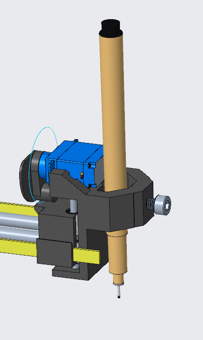

# Grbl with Pen Servo Feature for CoreXY machine(Arduino UNO - ATMega328p version)

#### This is standard [Grbl](https://github.com/gnea/grbl) modified for use with a pen plotter that has a hobby servo for the pen up / down.

The servo will have two positions representing up and down. You use normal gcode. Any time the work Z is above 0 the servo will move to the pen up position. If it is at Z 0 or below it will be in the pen down position.

Installation

Grbl installs as a library. Install Grbl normally as [described here](https://github.com/gnea/grbl/wiki/Compiling-Grbl) and then copy the files in the repo over the Grbl files.

#### Default setup.

The default setup is for a buildlog.net Pen/Laser Bot Controller. If you are not using that, you need to make sure your schematic matches the pin defined in cpu_map.h

#### Pen Up / Down Positions

There are (2) defined values in spindle_control.c. You can adjust these values to suite your machine. You can even reverse them to reverse the travel of your servo. Make sure the new setting does not cause the servo to hit an endpoint or it will overheat and damage itself.

define PEN_SERVO_DOWN     8

define PEN_SERVO_UP       16

#### Performance Tips

Grbl is still running a full range virtual Z axis with accelerations and speeds. Be aware how this will affect your pen. For example: If the Z is at 5 and you tell it to go to -5, the pen will stay up as the virtual z moves from 5 to 0. The pen will then go down. The virtual Z will continue to go down to -5 before it executes the next move. You can control these "delays" by adjusting the speed and acceleration of the Z axis and what your CAM uses a Z locations for up and down.

If you want to have the pen go to the up position at turn on, define a negative Z work offset. Send the command "G10 L2 P0 Z-2". This will trick Grbl into thinking the pen needs to be up.
